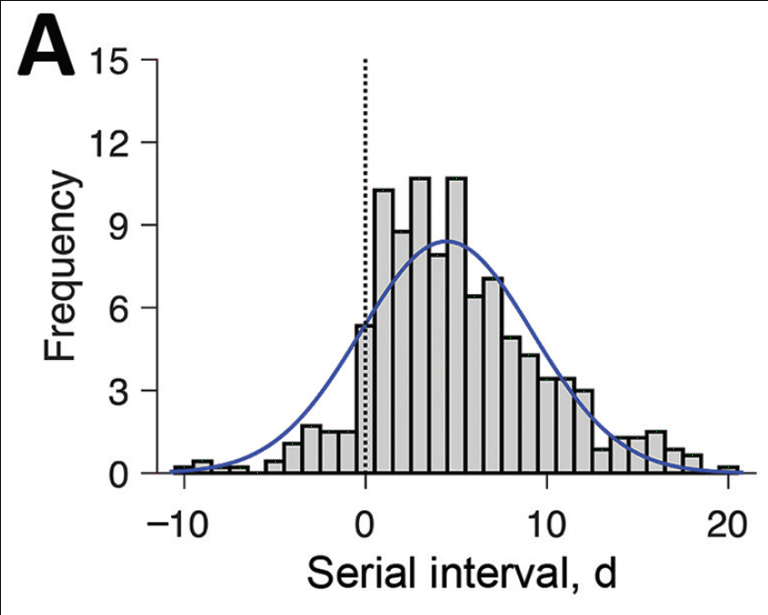

=========
Datathief
=========

Small utility for retrieving data from figures. Inspired by the `Java package of the same name <https://datathief.org/>`__.

Installation
------------

The usual: ``pip install datathief``.

Usage
-----

Unlike the Java DataThief package and similar online tools, here the user *manually* annotates the figure with the data points of their choosing. This makes it more transparent how the data are being read and makes the results more reproducible. However, it might be annoying for a large amount of data.

To use this tool, first annotate the plot by adding a **single pixel** at the start and end of the x-axis in a specified color that does not exist anywhere else in the image (default color: pure blue). Do the same for the y-axis (default color: pure red). Then one pixel for each data point you wish to extract (default color: pure green). This function will then return the x and y coordinates of each data point. It will warn you if too many or too few pixels are detected.

For example, running this code:

.. code:: python

    import datathief as dt
    filename = 'du_fig1a_annotated.png'
    xlim = [-10, 20]
    ylim = [0, 15]
    data = dt.datathief(filename, xlim=xlim, ylim=ylim)

On this input (NB, you might need to zoom in to see the individual pixels):

|Input|

Extracts the data for this plot:

|Output|

See the examples folder for more information. (Figure courtesy Du et al., https://www.medrxiv.org/content/10.1101/2020.02.19.20025452v4) 

.. |Output| image:: examples/example-output.png